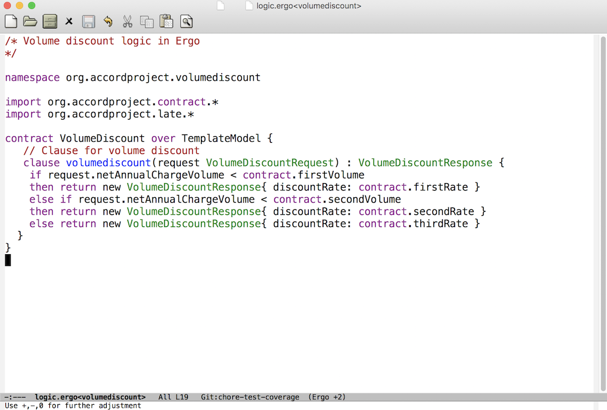

This is ergo-mode, the Emacs mode for editing Ergo code.

# Credits & Disclaimer

This is a heavily hacked Emacs mode based on [go-mode.el](https://github.com/dominikh/go-mode.el)

This is meant as an experiment to show some level of Ergo syntax highlighting and code indentation. This hasn't been heavily tested, but feel free to try it. Contributions are very welcome.

## Installation

To install ergo-mode, place `ergo-mode.el` in a directory of your choice, add it to your Emacs load path and require `'ergo-mode`:

    (add-to-list 'load-path "/place/where/you/put/it/")
    (require 'ergo-mode)

## Try it

Samples can be found in the Ergo distribution: [http://github.com/accordproject/ergo](http://github.com/accordproject/ergo)

Once installed, opening Ergo files in Emacs should look something like that:

## License

This is distributed under the same terms as go-mode.el, see [LICENSE](https://github.com/accordproject/ergo-mode/blob/master/LICENSE)

Copyright 2018 Clause, Inc.

